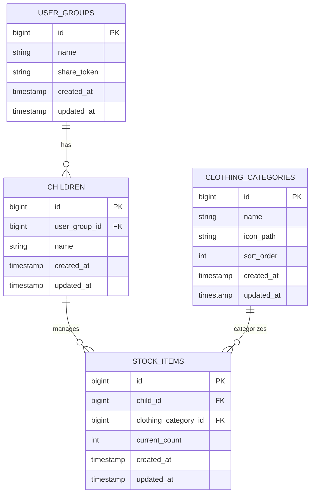

# ふくぽち - データベース設計

## データ構造概要

```plaintext
UserGroup（家族単位）
  └ Children（子ども）
       └ StockItems（衣類カテゴリ）
             └ current_count（整数）
```

## ER図（Mermaid記法）



## テーブル設計

### user_groups テーブル
| カラム名 | 型 | 制約 | 説明 |
|----------|-------|------|------|
| id | BIGINT | PRIMARY KEY, AUTO_INCREMENT | ユーザーグループID |
| name | VARCHAR(255) | NOT NULL | グループ名（家族名など） |
| share_token | VARCHAR(255) | UNIQUE, NOT NULL | 共有用トークン |
| created_at | TIMESTAMP | DEFAULT CURRENT_TIMESTAMP | 作成日時 |
| updated_at | TIMESTAMP | DEFAULT CURRENT_TIMESTAMP ON UPDATE CURRENT_TIMESTAMP | 更新日時 |

### children テーブル
| カラム名 | 型 | 制約 | 説明 |
|----------|-------|------|------|
| id | BIGINT | PRIMARY KEY, AUTO_INCREMENT | 子どもID |
| user_group_id | BIGINT | FOREIGN KEY, NOT NULL | ユーザーグループID |
| name | VARCHAR(255) | NOT NULL | 子どもの名前 |
| created_at | TIMESTAMP | DEFAULT CURRENT_TIMESTAMP | 作成日時 |
| updated_at | TIMESTAMP | DEFAULT CURRENT_TIMESTAMP ON UPDATE CURRENT_TIMESTAMP | 更新日時 |

### clothing_categories テーブル
| カラム名 | 型 | 制約 | 説明 |
|----------|-------|------|------|
| id | BIGINT | PRIMARY KEY, AUTO_INCREMENT | 衣類カテゴリID |
| name | VARCHAR(255) | NOT NULL | カテゴリ名 |
| icon_path | VARCHAR(255) | NULL | アイコンファイルパス |
| sort_order | INT | NOT NULL, DEFAULT 0 | 表示順序 |
| created_at | TIMESTAMP | DEFAULT CURRENT_TIMESTAMP | 作成日時 |
| updated_at | TIMESTAMP | DEFAULT CURRENT_TIMESTAMP ON UPDATE CURRENT_TIMESTAMP | 更新日時 |

### stock_items テーブル
| カラム名 | 型 | 制約 | 説明 |
|----------|-------|------|------|
| id | BIGINT | PRIMARY KEY, AUTO_INCREMENT | ストックアイテムID |
| child_id | BIGINT | FOREIGN KEY, NOT NULL | 子どもID |
| clothing_category_id | BIGINT | FOREIGN KEY, NOT NULL | 衣類カテゴリID |
| current_count | INT | NOT NULL, DEFAULT 0 | 現在のストック数 |
| created_at | TIMESTAMP | DEFAULT CURRENT_TIMESTAMP | 作成日時 |
| updated_at | TIMESTAMP | DEFAULT CURRENT_TIMESTAMP ON UPDATE CURRENT_TIMESTAMP | 更新日時 |

## 制約・インデックス

### 外部キー制約
- `children.user_group_id` → `user_groups.id`
- `stock_items.child_id` → `children.id`
- `stock_items.clothing_category_id` → `clothing_categories.id`

### ユニークキー制約
- `user_groups.share_token` （UNIQUE）
- `stock_items(child_id, clothing_category_id)` （UNIQUE COMPOSITE）

### インデックス
- `children(user_group_id)`
- `stock_items(child_id)`
- `stock_items(clothing_category_id)`

## 初期データ（clothing_categories）

| id | name | icon_path | sort_order |
|----|------|-----------|------------|
| 1 | Tシャツ | /icons/tshirt.svg | 1 |
| 2 | ズボン | /icons/pants.svg | 2 |
| 3 | 靴下 | /icons/socks.svg | 3 |
| 4 | ハンカチ | /icons/handkerchief.svg | 4 |
| 5 | 肌着 | /icons/underwear.svg | 5 |
| 6 | ぼうし | /icons/hat.svg | 6 |
| 7 | 水着セット | /icons/swimwear.svg | 7 |
| 8 | ビニール袋 | /icons/plastic_bag.svg | 8 |

## データ仕様

- **衣類カテゴリは固定・追加不可**: 8種類のカテゴリのみ対応
- **ストック数は「現在数のみ」保持**: 最大数や補充目安は今後検討
- **share_token**: URL共有による一時的なアクセス共有で使用
- **current_count**: 負の値は許可しない（アプリケーション側で制御）